# Introduction and disclaimer

- The materials for this presentations have been borrowed from the videos of the excellent course -now extinct- PH525x Genomics Data Analysis.

- The course has evolved into three MOOCS which are simply __a must__ for anyone interested in a serious application of statistics to omics sciences.

[HarvardX Biomedical Data Science Open Online Training](http://rafalab.github.io/pages/harvardx.html)


# From experimental designs to linear models

- An appropriate experimental design

    + Can save time and money in any type of experimental study,and as such in omics experiments.
    + Is the basis for estimating variability and estimating and comparing treatment effects.
    + Can be used to _deal_ with problems such as confounding and batch effect.

- Experimental designs and linear models

    + Linear models assume a linear relation between a (_response_) variable, also called dependent variable and one or more (explanatory) variables(s) also called dependent variables.

    + Linear models provide a convenient setting to describe experimental designs and to analize data that has been obtained from experiments performed according to the design they describe (more about this later)

----

# Linear model of 2 groups = t-test

 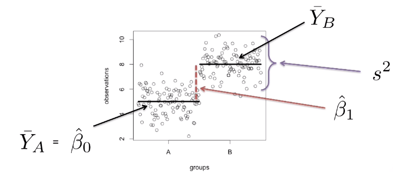 
 
A comparison of two groups

----

# Two group comparison as linear model


  

----

# Linear models in general

 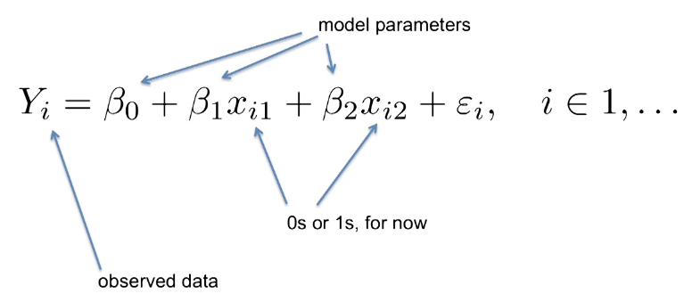 

----

# Linear models of 3 groups

  

----
 
# Linear models of 3 groups $\neq$ t-tests

 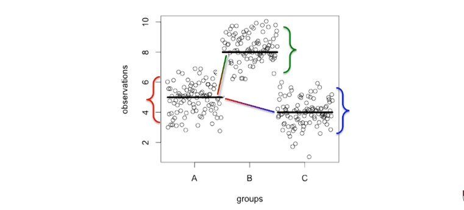 
 
# Matrix notation for linear models

  

----

# Computers prefer matrices

 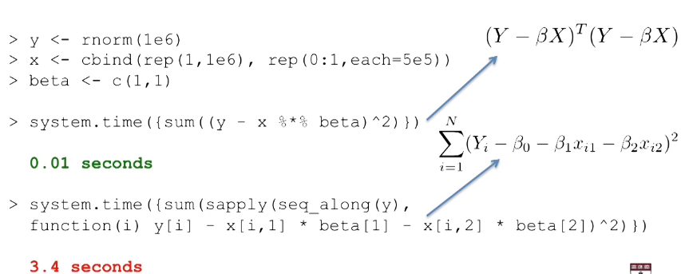 


----

# Rewriting two groups in matrix notation

 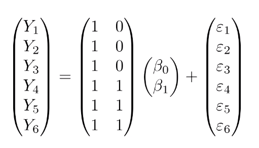 

----

# Rewriting three groups in matrix notation

 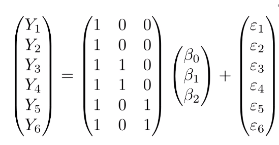 

----

# Fitting linear models and Testing

Solving linear models

  

Testing significance

 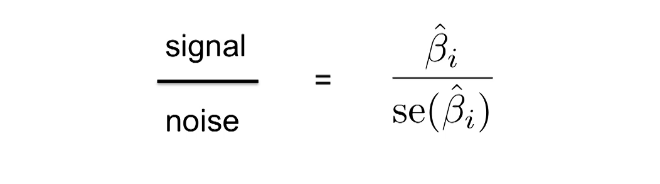 
 
 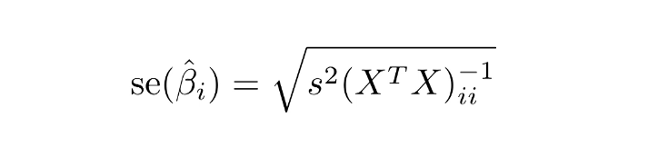 
 

# The power of linear models: crossed designs

 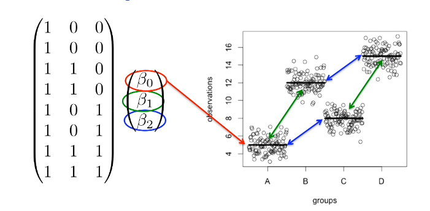 


We assume effects are additive!

----

# Crossed designs with interaction

 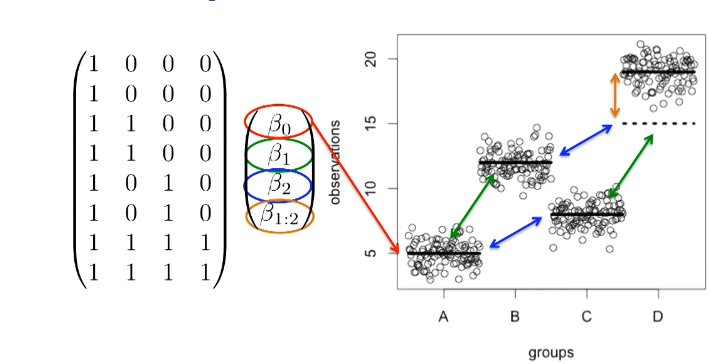 
 
Interaction shows additional to additive effects

----

# How linear models are often used

A common quote in science papers:

_"The study of ... controlled for age, race, and sex ..."_

When what they really mean is: 

 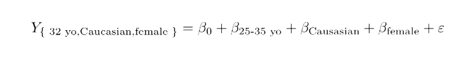 

But __do we really believe that age effect is linear?__


# Linear models and the Design Matrix using R formulae

Here we will show how to use the two R functions, `formula`
and `model.matrix`, in order to produce *design matrices* (also known as *model matrices*) for a variety of linear models. 

For example a linear model to describe a study comparing diets in mice can be written as

$$ 
Y_i = \beta_0 + \beta_1 x_i + \varepsilon_i, i=1,\dots,N 
$$

with $Y_i$ the weights 
and $x_i$ equal to 1 only when mouse $i$ receives the high fat diet. 

We use the term _experimental unit_ to $N$ different entities from which we obtain a measurement. In this case, the mice are the experimental units. 

----

We call thees variables _indicator variables_ since they simply indicate if the experimental unit had a certain characteristic or not. 

We can use linear algebra to represent this model:

$$
\mathbf{Y} = \begin{pmatrix}
Y_1\\
Y_2\\
\vdots\\
Y_N
\end{pmatrix}
,
\mathbf{X} = \begin{pmatrix}
1&x_1\\
1&x_2\\
\vdots\\
1&x_N
\end{pmatrix}
,
\boldsymbol{\beta} = \begin{pmatrix}
\beta_0\\
\beta_1
\end{pmatrix} \mbox{ and }
\boldsymbol{\varepsilon} = \begin{pmatrix}
\varepsilon_1\\
\varepsilon_2\\
\vdots\\
\varepsilon_N
\end{pmatrix}
$$


as: 


$$
\,
\begin{pmatrix}
Y_1\\
Y_2\\
\vdots\\
Y_N
\end{pmatrix} = 
\begin{pmatrix}
1&x_1\\
1&x_2\\
\vdots\\
1&x_N
\end{pmatrix}
\begin{pmatrix}
\beta_0\\
\beta_1
\end{pmatrix} +
\begin{pmatrix}
\varepsilon_1\\
\varepsilon_2\\
\vdots\\
\varepsilon_N
\end{pmatrix}
$$

or simply: 

$$
\mathbf{Y}=\mathbf{X}\boldsymbol{\beta}+\boldsymbol{\varepsilon}
$$

The design matrix is the matrix $\mathbf{X}$.

----

Once we define a design matrix, we are ready to find the least squares estimates. We refer to this as _fitting the model_. 

We have seen that this can be expressed in matrix notation as: 

 

In practice however __we rarely compute directly the expression above__. 

Instead, for fitting linear models in R, we will provide a _formula_ to the `lm` function. 

This is illustrated in the following slides using the `model.matrix` function, which is used internally by the `lm` function. 

This will help us to connect the R `formula` with the matrix $\mathbf{X}$. It will therefore help us interpret the results from `lm`.

----

# Expressing experimental designs using R formula

We will show how to use the two base R functions

- `formula`
- `model.matrix`

in order to produce *design matrices* (also known as *model matrices*) for a variety of linear models. 

The choice of design matrix is a critical step in linear modeling as it encodes which coefficients will be fit in the model, and the inter-relationship between the samples. 

----

## Model matrix for two groups

- Suppose we have two groups, 1 and 2, with two samples each. 
- We might start to encode this experimental design like so:


```{r}
x <- c(1,1,2,2)
f <- formula(~ x)
f
```

- Note that an intercept will be included by default, so the formula could equivalently be written: `~ x + 1`.

- We can then inspect the design matrix which is formed by this:

```{r}
model.matrix(f)
```

----

## model.matrix requires factors

- Note, this is not the design matrix we wanted. 
- We should instead first tell R that these values should not be interpreted numerically, but as different levels of a factor variable:

```{r}
x <- factor(c(1,1,2,2))
model.matrix(~ x)
```

- Now we have achieved the correct design matrix.
- Or have we?

----

## The role of the intercept term

- Note that the previous matrix has one intercept column and one group column although there are two groups indeed.
    + The first group's values are represented by the basal or "overall mean". 
    + The second group's are represented by one column.
- An alternative representation is possible setting the intercept to zero.
```{r}
x <- factor(c(1,1,2,2))
model.matrix(~ x + 0)
```

- Both representations are equivalent and for one-factor designs it's up to you which one to choose


# Design matrix for more than 2 groups

- How is the design matrix for an experiment with 3 groups?
- We proceed like in the previous case

```{r}
x <- factor(c(1,1,2,2,3,3))
model.matrix(~ x)
```

- Again the first group is implicit in the intercept but it can be set explicitly by setting the intercept to zero.

----

- An alternate formulation of design matrix is possible by specifying `+0` in the  formula:

```{r}
x <- factor(c(1,1,2,2,3,3))
model.matrix(~ x + 0)
```
This representation allows fitting a separate coefficient for each group. 

----

# Design matrices for more complex designs

- Matrices for more complex designs can be built easily by 
    + First creating the corresponding factors with their levels and then
    + Applying model.matrix on a formula that describes the design
    
- For example for a $2\times2$ design without interaction::

```{r}
x <- factor(c(1,1,1,1,2,2,2,2))
y <- factor(c("a","a","b","b","a","a","b","b"))
mm<- model.matrix(~ x + y)
```

- We could say that this linear model accounts for differences in both the x and y variables.
- We assume in the above model specification, that the effect of the x and y variables are simply additive. Being in group 2 and group b is equal to the difference between 2 and 1 and the difference between b and a. 

----

```{r}
x <- factor(c(1,1,1,1,2,2,2,2))
y <- factor(c("a","a","b","b","a","a","b","b"))
model.matrix(~ 0+ x + y)
```

- Notice that adding a 0 term only provides two columns for the first factor

----

## Design matrix for designs with interaction term

- Another model is possible which fits and additional term, which encodes the potential interaction of x and y variables. 
- This can be written in either of the following two formula:

```{r}
model.matrix(~ x + y + x:y)
model.matrix(~ x*y)
```

# Linear models for microarray data

- For the analysis of omics data a very popular option is the `limma` package.
- `limma` extends some R functionalities to make them easy to use in the analysis of omics data using linear models.
- Besides this it includes extensions to the standard linear model to improve analysis capabilities.
- In the following we show
    + How to create a design matrix from a "targets" file containing information on groups.
    + How to create a contrasts matrix to define the comparisons to be done.
    + How to do the comparisons and how to interpret the resulting analysis tables.


